# TriLo
## 📖 목차
- [💽 GitHub Repository](#-github-repository)
- [🥅 프로젝트 개요](#-프로젝트-개요)
- [🛠️ 사용 기술](#-사용-기술)
- [🧱 애플리케이션 내부 아키텍처](#-애플리케이션-내부-아키텍처)
- [🏛️ 애플리케이션 외부 아키텍처(인프라)](#-애플리케이션-외부-아키텍처인프라)
- [♾️ 지속적 통합, 지속적 배포](#-지속적-통합-지속적-배포)
- [🤔 문제 해결 시행착오](#-문제-해결-시행착오)
    - [JPA 지연로딩을 통해 조회되는 엔티티에 대한 동등성 문제를 페치조인으로 해결](#jpa-지연로딩을-통해-조회되는-엔티티에-대한-동등성-문제를-페치조인으로-해결)
    - [드래그 앤 드랍 기능 설계](#드래그-앤-드랍-기능-설계)
- [💾 데이터베이스 설계](#-데이터베이스-설계)
- [✅ 테스트코드](#-테스트코드)
- [📄 Spring Rest Docs를 사용한 API 명세 작성](#-spring-rest-docs를-사용한-api-명세-작성)
- [📜 API 명세](#-api-명세)

---

## 💽 GitHub Repository
- [https://github.com/ttasjwi/trilo-be](https://github.com/ttasjwi/trilo-be)

---

## 🥅 프로젝트 개요

- 사용자 각각이 여행 일정을 잡아서 자신의 여행 일정을 공유할 수 있도록 하는 애플리케이션 서비스입니다.
- 실제 AWS EC2에 배포했었으나, 현재 비용문제 사정상 배포를 중단했습니다.
- 총 5명 인원이 협력하여 진행하였습니다.
    - FE: [Oliver](https://github.com/jthw1005), [Bangtae](https://github.com/bangdler)
    - BE: [땃쥐(강전용)](https://github.com/ttasjwi), [LUKAS](https://github.com/pia2011)
    - Design: Joy
- 담당 업무
    - 여행/일정 비즈니스 로직 구현
    - 지속적 통합, 지속적 배포 담당
    - API 명세 문서화

---

## 🛠️ 사용 기술

- 개발
    - 언어: Java
    - 프레임워크 : Spring Framework
        - Spring Boot
        - Spring MVC
        - Spring Data JPA
        - Spring Data Redis
    - 데이터베이스 : MySQL
    - 그 외 : QueryDSL
- 배포
    - 구성: AWS EC2, Nginx
    - CI/CD: GitHub Actions (지속적 통합, 무중단 배포)
- 이슈 트래커: JIRA
- 형상관리: Git, GitHub

---

## 🧱 애플리케이션 내부 아키텍처
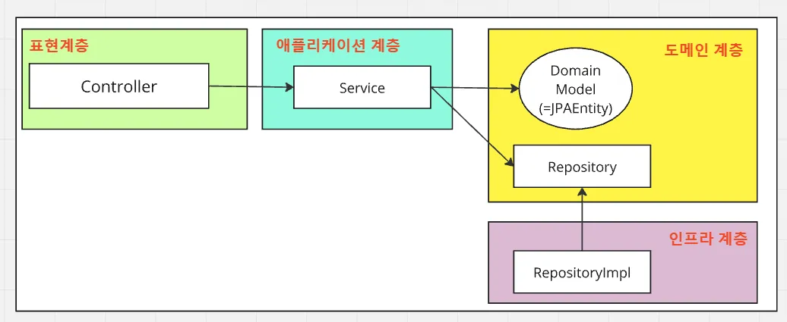

- 단순한 의존성 역전원칙이 적용된 레이어드 아키텍처를 사용했습니다.
- 초기에는 헥사고날 아키텍처와 같은 특수한 아키텍처 사용을 시도했지만, 개발 비용이 증가하는 문제가 있다는 문제, 학습곡선 불일치 등으로 인해 합의를 거쳐서, 레이어드 아키텍처를 사용하도록 변경했습니다.
- JPA 기술의 편의성을 위해 도메인 계층 코드에 JPA 기술 코드를 넣어서 사용하도록 했습니다.
- 아키텍처의 장점
    - 구조가 단순하여 개발비용이 상대적으로 적어졌습니다.
    - JPA 모델을 별도로 만들지 않고 바로 JPA 기술을 애플리케이션에서 사용할 수 있습니다.
        - 예) 지연로딩, 변경감지(Dirty Checking) 을 통한 자동 변경쿼리 실행 편의
- 아키텍처의 한계
    - JPA 기술이 도메인/애플리케이션 코드 로직에 함께 침투했습니다.  만약 팀의 결정으로 JPA 를 쓰지 않기로 결정이 바뀌었다면 도메인 코드를 변경해야하고, 변경감지를 의존해서 작동하던 애플리케이션 계층 코드도 변경해야합니다.
    - 단위테스트를 실행할 때는 의도한대로 작동했었지만, 실제 프로덕션 환경에서는 의도하지 않은 동작이 발생한 바 있습니다. JPA가 함께 동작할 떄, 런타임에는 도메인 모델 인스턴스가 실제로는 JPA 가 만들어준 프록시 객체로 동작하게 되어 의도치 않은 문제가 발생했었습니다.
    - 이 문제는 도메인 코드 수정 및 통합테스트 보강으로 해결했긴 하지만, 통합테스트를 통해서만 제대로 작동함을 확인할 수 있다는 점에서 테스트코드가 아키텍처에 대한 적신호를 보여준 사례입니다.
    - 하지만 그렇다고 해서 현 시점에서 아키텍처를 변경하는 것은 오히려 개발비용이 커지기 때문에 트레이드 오프를 통해 현 아키텍처를 유지하기로 했습니다.

---

## 🏛️ 애플리케이션 외부 아키텍처(인프라)
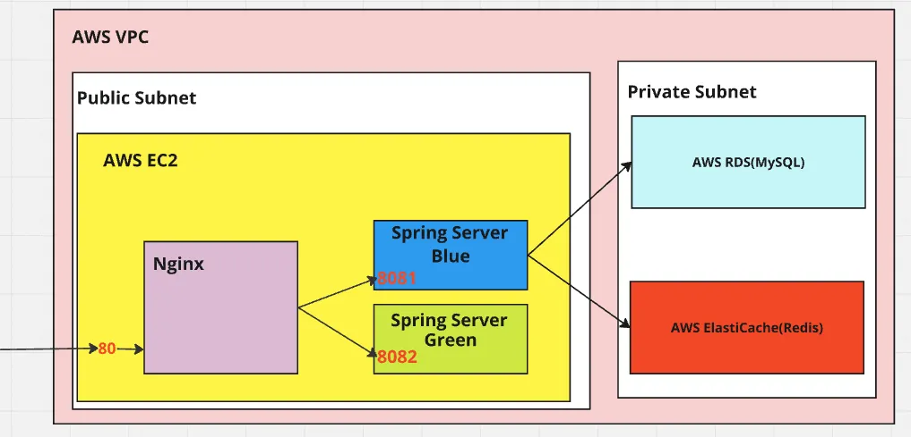

- AWS의 프리티어 지원(일정 한도 내에서 12개월 무료로 서비스 이용)을 이용하여 인프라를 구성했습니다.
- EC2 인스턴스 내부에 Nginx 서버 및 애플리케이션 서버(Blue, Green)를 구성했습니다.
- RDS(MySQL), ElastiCache(Redis) 를 통해 데이터를 저장합니다.

---

## ♾️ 지속적 통합, 지속적 배포
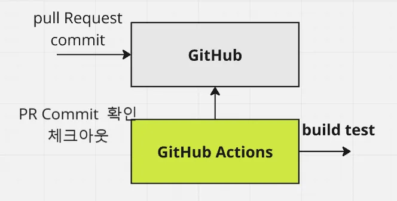

- Git을 통해 형상관리를 하고, GitHub 코드 베이스에 코드를 공유합니다.
- PR(Pull Request) 단위로 기능을 구현하고 PR에 새로운 커밋이 푸시될 때마다 빌드테스트가 작동하도록 자동화했습니다.(GitHub Actions)
- PR 브랜치 최신의 커밋이 빌드 과정에서 실패상태일 경우, Master 브랜치에 Merge 할 수 없도록 제약조건을 추가하여 Master 브랜치의 코드 신뢰도를 지속적으로 유지하도록 했습니다.

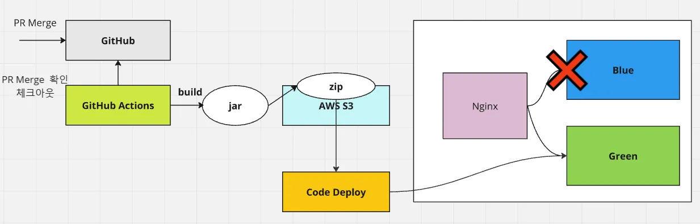

- 마스터 브랜치에 PR 브랜치가 Merge 될 경우, GitHub Actions 배포 스크립트를 실행하여 배포하도록 했습니다.
- 빌드를 거쳐서 만들어진 jar 파일로을 zip 파일로 구성하여 AWS S3에 업로드한 뒤, Code Deploy 를 사용해 EC2 인스턴스에서 끌어와서 애플리케이션을 실행하게 했습니다.
    - Code Deploy 에이전트
- Blue/Green 방식을 사용한 **무중단 배포**를 적용했습니다.
    - 새로 전송된 jar 파일을 실행하고 기존 배포되던 프로세스를 중지합니다.
    - Nginx 가 가리키는 대상 서버를 변경하게 합니다.
    - 최종 사용자 입장에서는 이용 중단되지 않으면서 새로운 기능을 사용 가능합니다.

---

## 🤔 문제 해결 시행착오

### [JPA 지연로딩을 통해 조회되는 엔티티에 대한 동등성 문제를 페치조인으로 해결](https://ttasjwi.tistory.com/128)

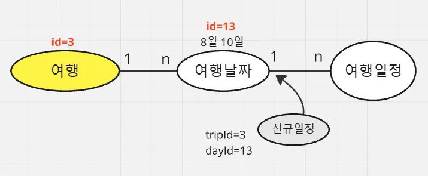

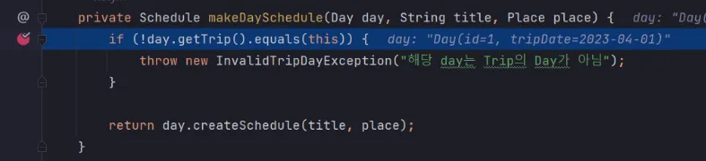

- 사용자는 일정을 추가할 때 특정 여행(trip)의 특정 날짜(day)에 여행 일정을 추가할 수 있습니다.
- 이 과정에서 사용자가 제 애플리케이션에서는 여행의 특정 날짜에 일정을 추가하는 과정에서,  사용자가 지정한 날짜가 속한 여행이 실제 사용자가 지정한 여행에 속하는 지 확인하는 로직이 존재합니다. 이 과정에서 여행날짜(day)에 대해 `getTrip()` 을 통해 실제 trip 을 가져오고,  equals 를 사용합니다.
- 이 기능은 단위테스트를 작성했을 때는 의도적으로 동작했습니다.

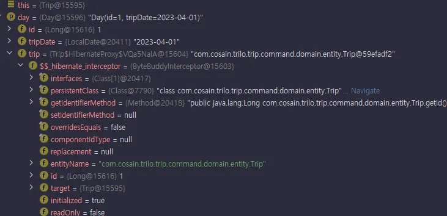

- 하지만 런타임에는 여행 날짜에 속한 여행을 지연로딩을 통해 가져오는 과정에서 예상치 못 한 문제가 발생했습니다. day가 가진 여행이 스프링이 만들어준 프록시 객체로 주입되는 바람에 동등성 비교가 예상한 대로 작동하지 않았습니다.

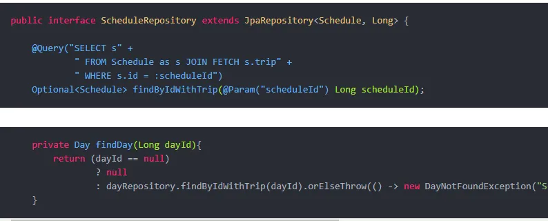

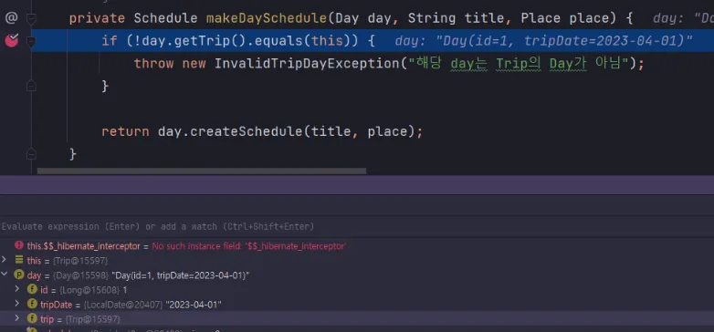

- 여행 날짜가 가진 여행을 지연로딩으로 가져오게 되면 그 자리에 프록시가 위치하므로 비즈니스로직이 의도치않게 동작하므로, 저는 실제 여행이 주입될 수 있도록 JPA의 페치조인 기능을 사용하여 실제 여행을 여행날짜 조회시점에 함께 가져올 수 있도록 하여 문제를 해결했습니다.

### 드래그 앤 드랍 기능 설계

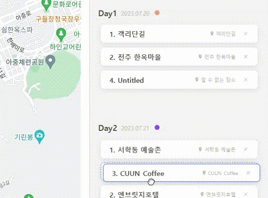

- 드래그 앤 드랍을 백엔드에서 처리하는 부분의 설계 관점에서 문제를 겪었습니다.
- ‘여행 일정’은 드래그 앤 드롭을 통해 여행의 같은 날짜 또는 다른 날짜, 임시보관함의 특정 순서로 위치를 수정할 수 있는데, 이 기능을 서버에서 어떤 형태로 구현해야하는 지에 대한 문제가 있었습니다.
- 저는 드래그 앤 드랍을 두 가지 관점에서 접근해봤습니다.
    - 연결리스트 방법
    - 순서값 방법

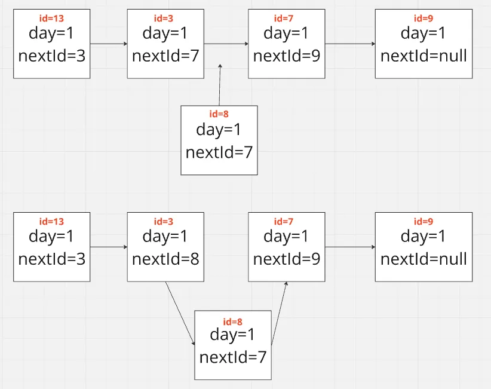

<연결리스트 방식>

- 연결리스트 방법은 각 일정이 자신의 뒤에 있는 일정의 식별자를 가지는 방식입니다.
- 맨 앞 삽입, 중간 삽입, 맨 뒤 삽입 모든 과정에서 중간 삽입 시 앞 뒤의 일정들이 다음에 위치한 일정의 식별자를 변경하는 식으로 처리하면 간단하게 3개의 일정을 수정하여, 드래그앤 드랍 로직을 처리할 수 있습니다. 코드 작성 관점에서 놓고보면 아래에서 후술할 순서값 방법보다 간단하고 읽기 쉬울 것으로 예상됩니다.
- 하지만 조회 성능이 나빠집니다. 특정 날짜의 일정들을 모두 조회하고 순서대로 사용자에게 전달해야하는데 맨 앞 일정을 찾아서, 뒤의 일정을 순서대로 연결하는 정렬작업을 거쳐서 사용자에게 내보내는 과정을 거쳐야하기 때문입니다.

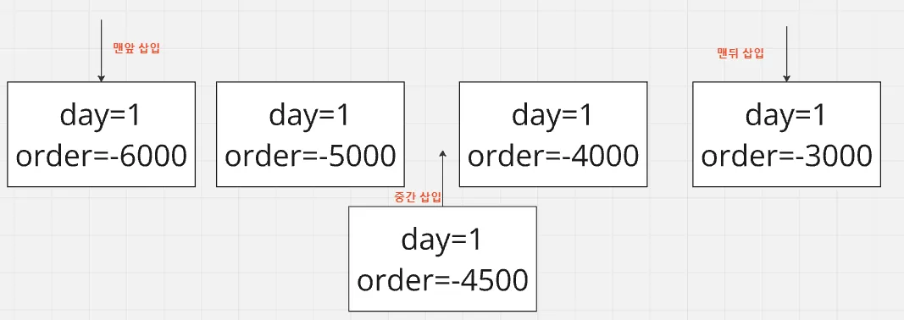

<순서값 방식>

- 순서값 방법은 각 일정이 순서값을 가지게 하고, 순서값의 대소관계로 일정의 순서를 구분하는 방식입니다.
- 일정을 특정 날짜의 맨 앞/맨 뒤로 이동시킬 경우 맨앞/맨뒤일정에서 일정값 만큼 낮거나 큰 순서를 가지게 순서값을 변경합니다.
- 일정을 특정 두 일정 사이로 중간 삽입시킬 경우, 앞뒤 일정 순서값의 중간값을 부여합니다.

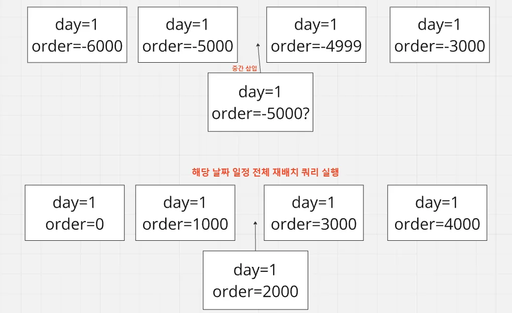

- 순서값 방식은 숫자값을 너무 작게 하거나, 크게 하면 저장 데이터 구조의 숫자 범위 문제가 발생하고, 중간삽입을 반복하면 앞뒤의 순서들과 충돌이 발생할 일이 생깁니다.
- 그래서 범위 문제, 충돌이 발생하는 순간에 벌크성 쿼리를 통해 해당 날짜 일정들 전체의 순서값 재배치를 해주는 작업이 필요합니다.
- 충돌 문제 때문에 충돌 발생시 벌크성 쿼리를 실행해야하는 문제가 있으나, 자주 일어나는 일이 아니기도 하고 조회/삽입의 종합적 성능 관점에서는 순서값 방식이 더 이득이 크다고 생각해서 순서값 방법을 선택했습니다.
- 회고
    - 결과론적으로 순서값 방법이 조회/삽입 시 성능상 이점이 커서 좋았습니다. 충돌 시 벌크성 쿼리를 날려야하는 문제가 있긴 하지만 자주 일어나는 일이 아닙니다.
    - 하지만 비즈니스로직에서 충돌여부를 지속적으로 체크하고, 복잡한 벌크성 SQL을 정기적으로 실행해야하는 사용하는 것이 기능의 코드 복잡도를 지나치게 높이는 문제가 있었습니다.
    - 벌크성 SQL 이 복잡하게 작성되어 있어 다른 동료가 읽기엔 주석이 많이 필요하고 수정하기 어렵게 됐습니다.
    - 조회 성능을 약간 손해보더라도 연결리스트 방법을 쓰는게 더 낫지 않았나 생각도 들긴 합니다.

---

## 💾 데이터베이스 설계
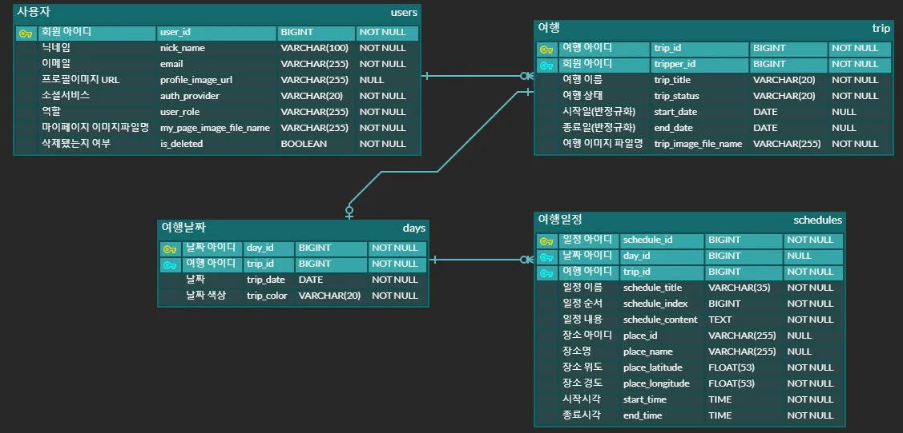

- 사용자: 우리 서비스의 사용자입니다.
- 여행: 사용자가 가진 ‘여행’ 개념입니다.
    - 사용자는 여행을 여러개 만들 수 있습니다.(1:n)
    - 여행은 기간이 정해지지 않은 상태로 존재할 수 있습니다.
    - 여행 기간이 있을 경우, 여행날짜가 별도의 테이블에서 관리됩니다.(1:n)
- 여행날짜: 여행에 기간이 있을 경우, 연속된 n 일의 여행날짜가 각각 관리됩니다.
- 여행일정: 사용자의 여행 속에서 속한 일정입니다.
    - 여행날짜에 속하는 여행일정이 있을 수 있고
    - 여행날짜에 속하지 않는 여행일정이 있을 수 있습니다. (이 경우는 임시보관함에 속한 여행일정으로 취급됩니다.)
- 한계
    - 장소 개념은 따로 데이터베이스 모델링하지 않았습니다. 요청 측에서 보낸 장소 정보를 그대로 사용하기로 했고, 여행일정 테이블에 같이 저장하기로 했습니다.(정규화 되지 않음)
    - 장소에 대해 전문가가 존재하고 많은 양의 장소를 관리할 수 있게 될 경우 이 부분은 따로 테이블을 분리하여 정규화할 필요가 있습니다.

---

## ✅ 테스트코드
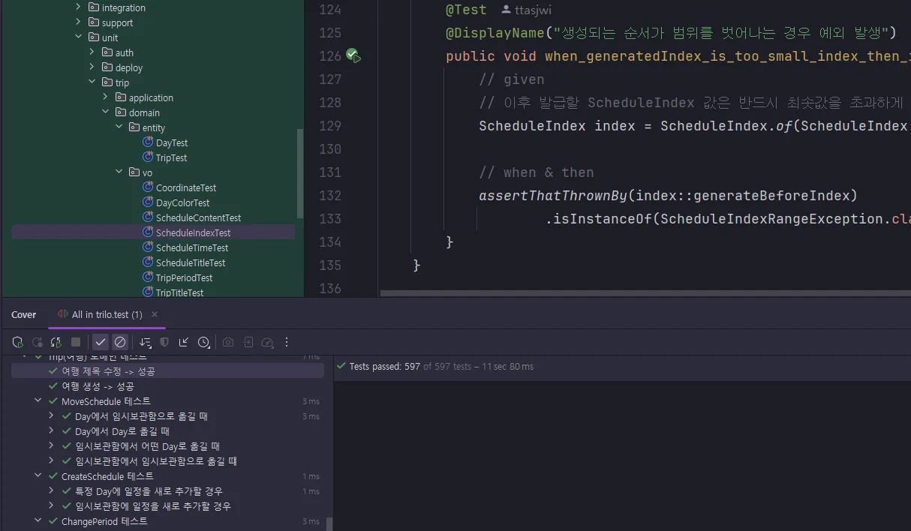

- 위에서 언급된 지속적 통합/지속적 배포(CI/CD) 파이프라인 작동 시 테스트코드 성공이 필요합니다.
- 저희는 애플리케이션의 신뢰성 유지를 위해 계속적으로 테스트코드를 작성했습니다.(총 597건)

---

## 📄 Spring Rest Docs를 사용한 API 명세 작성

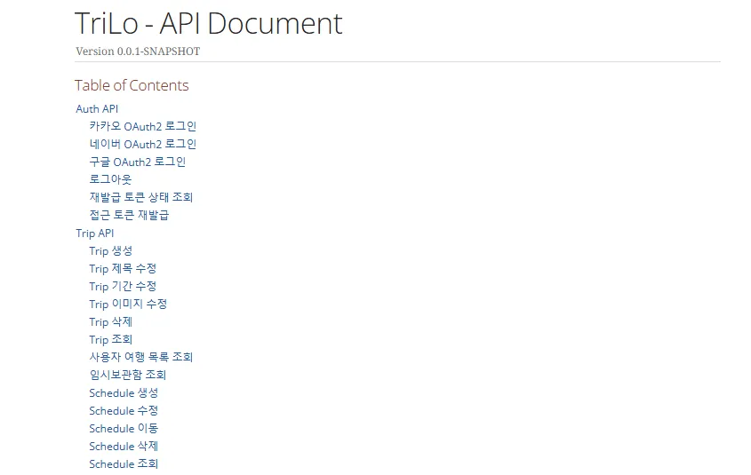

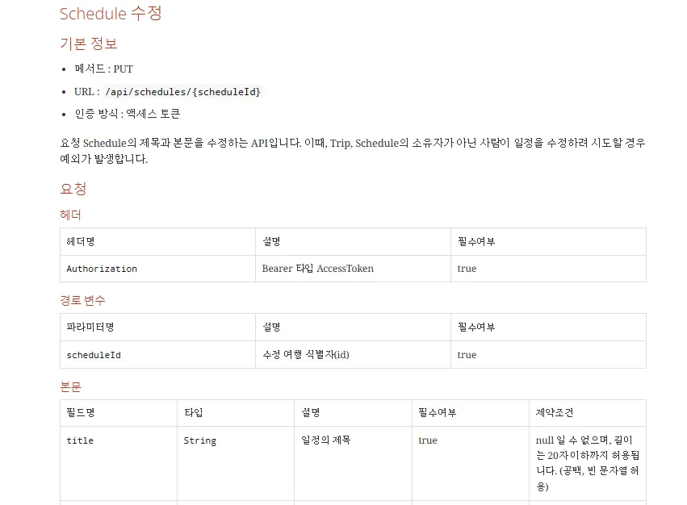

- Spring Rest Docs를 사용하여, 배포 서버 그 자체에서 API 문서를 배포했습니다.
- API 문서화는 Swagger 방식, Spring RestDocs 방식 두 가지의 선택지가 있었습니다.
    - Swagger 방식은 UI가 유저친화적이지만 main 소스셋 내부에 문서화를 위한 어노테이션을 추가적으로 달아줘야하는 문제가 존재하고, 테스트코드 기반의 문서화가 아닙니다.
    - Spring Rest Docs 방식은 개발자가 작성한 테스트 코드를 기반을 API 문서가 구성되기 때문에, API의 실제 구현 및 테스트 상태와 API 명세의 사양이 일치하게 되는 장점이 있었습니다. 하지만 UI가 사용자(동료 개발자) 친화적이지 않다는 단점이 있습니다.
- 저희 백엔드 팀에서는 테스트코드가 Rest Docs 에 반영되는 구조가 유지보수면에서 더 유용하다는 판단하에, Spring Rest Docs 방식을 사용하기로 선택했습니다.

---

## 📜 API 명세
(현재  API 서버가 배포되지 않고 있으므로, RestDocs가 공개되지 않고 있습니다. 따라서 GitHub Wiki 로 명세를 대체하여 공개하겠습니다.)

- 인증/인가
    - [구글 소셜 로그인](https://github.com/ttasjwi/trilo-be/wiki/%EA%B5%AC%EA%B8%80-%EC%86%8C%EC%85%9C-%EB%A1%9C%EA%B7%B8%EC%9D%B8-API-%EB%AA%85%EC%84%B8)
    - [카카오 소셜 로그인](https://github.com/ttasjwi/trilo-be/wiki/%EC%B9%B4%EC%B9%B4%EC%98%A4-%EC%86%8C%EC%85%9C-%EB%A1%9C%EA%B7%B8%EC%9D%B8-API-%EB%AA%85%EC%84%B8)
    - [네이버 소셜 로그인](https://github.com/ttasjwi/trilo-be/wiki/%EB%84%A4%EC%9D%B4%EB%B2%84-%EC%86%8C%EC%85%9C-%EB%A1%9C%EA%B7%B8%EC%9D%B8-API-%EB%AA%85%EC%84%B8)
    - [로그아웃](https://github.com/ttasjwi/trilo-be/wiki/%EB%A1%9C%EA%B7%B8%EC%95%84%EC%9B%83-API-%EB%AA%85%EC%84%B8)
    - [리프레시토큰 상태 조회](https://github.com/ttasjwi/trilo-be/wiki/%EB%A6%AC%ED%94%84%EB%A0%88%EC%8B%9C%ED%86%A0%ED%81%B0-%EC%83%81%ED%83%9C-%EC%A1%B0%ED%9A%8C-API-%EB%AA%85%EC%84%B8)
    - [액세스토큰 재발급](https://github.com/ttasjwi/trilo-be/wiki/%EC%95%A1%EC%84%B8%EC%8A%A4%ED%86%A0%ED%81%B0-%EC%9E%AC%EB%B0%9C%EA%B8%89-API-%EB%AA%85%EC%84%B8)
- 사용자
    - [회원 프로필 조회](https://github.com/ttasjwi/trilo-be/wiki/%ED%9A%8C%EC%9B%90-%ED%94%84%EB%A1%9C%ED%95%84-%EC%A1%B0%ED%9A%8C-API-%EB%AA%85%EC%84%B8)
    - [회원 탈퇴](https://github.com/ttasjwi/trilo-be/wiki/%ED%9A%8C%EC%9B%90-%ED%83%88%ED%87%B4-API-%EB%AA%85%EC%84%B8)
    - [회원 닉네임 수정](https://github.com/ttasjwi/trilo-be/wiki/%ED%9A%8C%EC%9B%90-%EB%8B%89%EB%84%A4%EC%9E%84-%EC%88%98%EC%A0%95-API-%EB%AA%85%EC%84%B8)
- 여행
    - [여행 생성](https://github.com/ttasjwi/trilo-be/wiki/%EC%97%AC%ED%96%89-%EC%83%9D%EC%84%B1-API-%EB%AA%85%EC%84%B8)
    - [여행 제목 수정](https://github.com/ttasjwi/trilo-be/wiki/%EC%97%AC%ED%96%89-%EC%A0%9C%EB%AA%A9-%EC%88%98%EC%A0%95-API-%EB%AA%85%EC%84%B8)
    - [여행 기간 수정](https://github.com/ttasjwi/trilo-be/wiki/%EC%97%AC%ED%96%89-%EA%B8%B0%EA%B0%84-%EC%88%98%EC%A0%95-API-%EB%AA%85%EC%84%B8)
    - [여행 이미지 수정](https://github.com/ttasjwi/trilo-be/wiki/%EC%97%AC%ED%96%89-%EC%9D%B4%EB%AF%B8%EC%A7%80-%EC%88%98%EC%A0%95-API-%EB%AA%85%EC%84%B8)
    - [여행 삭제](https://github.com/ttasjwi/trilo-be/wiki/%EC%97%AC%ED%96%89-%EC%82%AD%EC%A0%9C-API-%EB%AA%85%EC%84%B8)
    - [여행 조회](https://github.com/ttasjwi/trilo-be/wiki/%EC%97%AC%ED%96%89-%EC%A1%B0%ED%9A%8C-API-%EB%AA%85%EC%84%B8)
    - [사용자 여행 목록 조회](https://github.com/ttasjwi/trilo-be/wiki/%EC%82%AC%EC%9A%A9%EC%9E%90-%EC%97%AC%ED%96%89-%EB%AA%A9%EB%A1%9D-%EC%A1%B0%ED%9A%8C-API-%EB%AA%85%EC%84%B8)
    - [여행 날짜 색상 수정](https://github.com/ttasjwi/trilo-be/wiki/%EC%97%AC%ED%96%89-%EB%82%A0%EC%A7%9C-%EC%83%89%EC%83%81-%EC%88%98%EC%A0%95-API-%EB%AA%85%EC%84%B8)
    - [여행 날짜 단건 조회](https://github.com/ttasjwi/trilo-be/wiki/%EC%97%AC%ED%96%89-%EB%82%A0%EC%A7%9C-%EB%8B%A8%EA%B1%B4-%EC%A1%B0%ED%9A%8C-API-%EB%AA%85%EC%84%B8)
    - [여행 날짜 목록 조회](https://github.com/ttasjwi/trilo-be/wiki/%EC%97%AC%ED%96%89-%EB%82%A0%EC%A7%9C-%EB%AA%A9%EB%A1%9D-%EC%A1%B0%ED%9A%8C-API-%EB%AA%85%EC%84%B8)
    - [일정 생성](https://github.com/ttasjwi/trilo-be/wiki/%EC%9D%BC%EC%A0%95-%EC%83%9D%EC%84%B1-API-%EB%AA%85%EC%84%B8)
    - [일정 수정](https://github.com/ttasjwi/trilo-be/wiki/%EC%9D%BC%EC%A0%95-%EC%88%98%EC%A0%95-API-%EB%AA%85%EC%84%B8)
    - [일정 이동](https://github.com/ttasjwi/trilo-be/wiki/%EC%9D%BC%EC%A0%95-%EC%9D%B4%EB%8F%99-API-%EB%AA%85%EC%84%B8)
    - [일정 삭제](https://github.com/ttasjwi/trilo-be/wiki/%EC%9D%BC%EC%A0%95-%EC%82%AD%EC%A0%9C-API-%EB%AA%85%EC%84%B8)
    - [일정 단건 조회](https://github.com/ttasjwi/trilo-be/wiki/%EC%9D%BC%EC%A0%95-%EB%8B%A8%EA%B1%B4-%EC%A1%B0%ED%9A%8C-API-%EB%AA%85%EC%84%B8)
    - [일정 임시보관함 조회](https://github.com/ttasjwi/trilo-be/wiki/%EC%9D%BC%EC%A0%95-%EC%9E%84%EC%8B%9C%EB%B3%B4%EA%B4%80%ED%95%A8-%EC%A1%B0%ED%9A%8C-API-%EB%AA%85%EC%84%B8)

---
